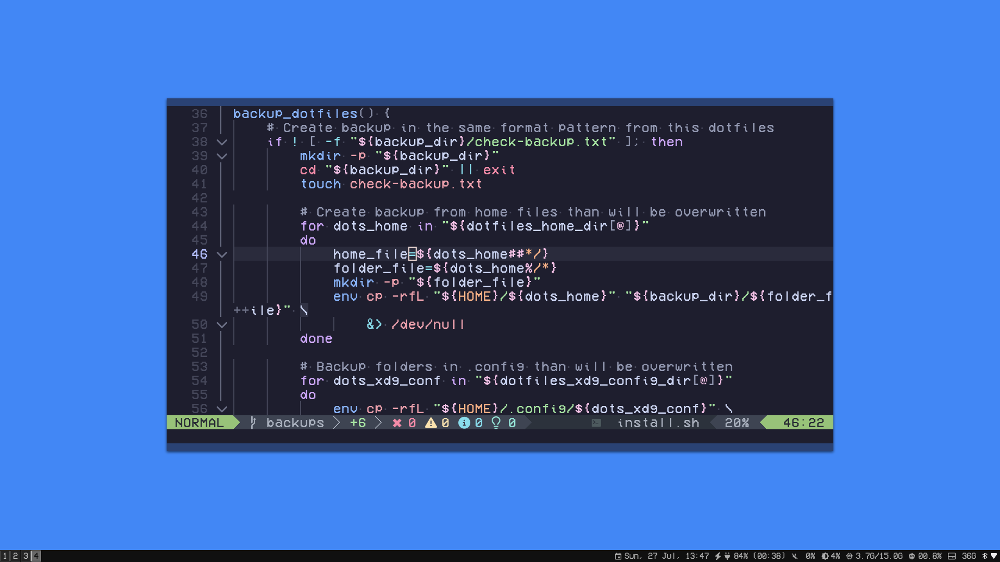

# Dotfiles

## Here are my dotfiles. That's it.



<p align="center">
    <b>Screenshots</b><br>
    <a href="images/rofi.png">Rofi</a>&nbsp;&nbsp;&nbsp;
    <a href="images/thunar.png">Thunar</a>&nbsp;&nbsp;&nbsp;
    <a href="images/tmux.png">Tmux</a>
</p>

## About this repository

While I'd love to try to make this work out of the box, that's not my main goal. I see this repository as a project to play around with Linux a bit and get a better understanding of the system. Feel free to use anything available here, and if you encounter any issues, feedback is welcome.

## Dependencies

I use Debian 12, and i normally use this dotfiles on top a XFCE fresh install. Below are the main programs I use and how I downloaded them:

| Item          | Source | Version   |
|---------------|--------|-----------|
| alacritty     | Cargo  | 0.15.1    |
| brightnessctl | Apt    | 0.5       |
| dunst         | Apt    | 1.9.0     |
| fastfetch     | Github | 2.48.1    |
| feh           | Apt    | 3.9.1     |
| fzf           | Github | 0.64.0    |
| git           | Apt    | 2.39.5    |
| gtk3          | Apt    | 3.24.38-2 |
| i3-wm         | Apt    | 4.22      |
| i3blocks      | Apt    | 1.4       |
| maim          | Apt    | 5.7.4     |
| rofi          | Apt    | 1.7.3     |
| picom         | Apt    | 9.1       |
| redshift      | Apt    | 1.12      |
| starship      | Cargo  | 1.88.0    |
| tmux          | Apt    | 3.3a      |
| thunar        | Apt    | 4.18.4    |
| xclip         | Apt    | 0.13      |

In addition, there are dependencies for GTK and for a font. They are

    - `Catppuccin-Mocha-Standard-Sky-Dark` theme for GTK.
    - `Material-Black-Blueberry-Numix-FLAT` icon theme for GTK.
    - `Bibata-Modern-Classic` cursor theme for GTK.
    - `VCROSDMono` font. A patched version of the VCROSD font.

All of these are inside the `resources` folder.

## Download and installation

At the root of the repository, there are two scripts: `download.sh` and `install.sh`:

- **download.sh** installs the necessary dependencies, whether they are from APT or not, like fzf and alacritty.
- **install.sh** simply creates the symlinks that point to the files inside the repository where the system expects to find the files, and decompress the resources in the correct folders. It also creates a simple backup of your current configuration, and allows you to restore it if something goes wrong.

This process can be automated with:

```bash
cd
sudo apt update
sudo apt install git
git clone https://github.com/alquimas/dotfiles .dotfiles && cd .dotfiles
chmod +x download.sh
./download.sh
chmod +x install.sh
./install.sh -i
```

Then reboot the system.
